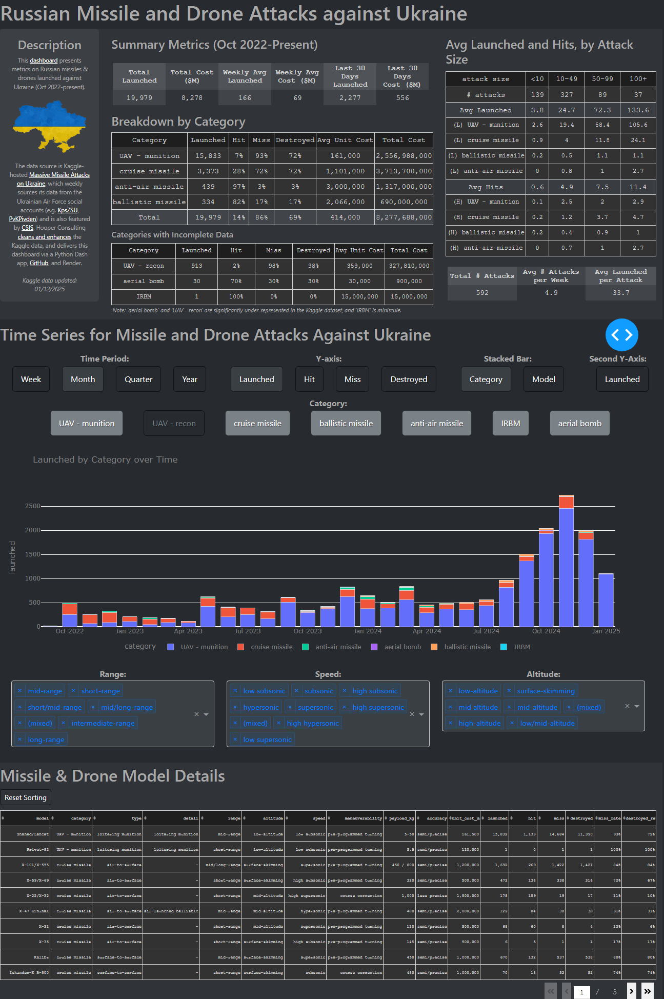

## Russia Missile and Drone Attacks Against Ukraine -- GitHub Repo for Dashboard

This GitHub repo hosts the Python-coded Dash app for Hooper Consulting's dashboard on Russia missile and drone attacks against Ukraine (Oct 2022-ongoing).

See a static image of the dashboard included here, and find the dynamic (live) dashboard at:
 https://ru-ukraine-missile-drone-attacks.onrender.com/

_(Note -- the live dashboard may take up to 1-2 minutes to load)_

**Overview of GitHub Files**
 ua5_ru_weapons.py is the file which is read and served to Render.com's web services app.
 ua5j_ru_weapons.ipynb is a Jupyter Notebook version of the same file (in which the data-cleaning and Dash app was initially coded).
 ua5_ru_weapons.png is a static image of the dashboard, as captured from running ua5j_ru_weapons.ipynb.
 The other files contain digital assets and data files used in preparing the data and dashboard.

**Data Source**
 The underlying data for the dashboard comes from [Massive Missile Attacks on Ukraine](https://www.kaggle.com/datasets/piterfm/massive-missile-attacks-on-ukraine),
a Kaggle-hosted dataset compiled from the Ukrainian Air Force's social accounts reports (e.g. [KpsZSU](https://facebook.com/kpszsu), [PvKPivden](https://facebook.com/PvKPivden)).

**Data Cleaning Process**
 Hooper Consulting cleans and enhances the Kaggle data via this [spreadsheet](https://docs.google.com/spreadsheets/d/1Zs705hRN7HfUOOhTZN2nNIPB6SAeKaxU1AQAkGZinzk/edit?usp=sharing
and the Python files. Furthermore, these Pythone files code a Dash app, which is served on Render.com (see above).
